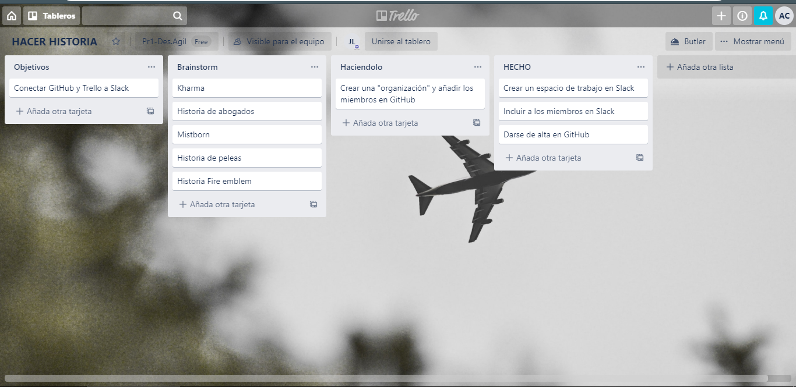
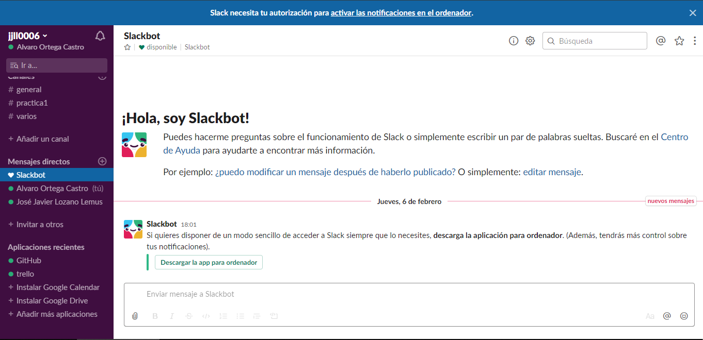
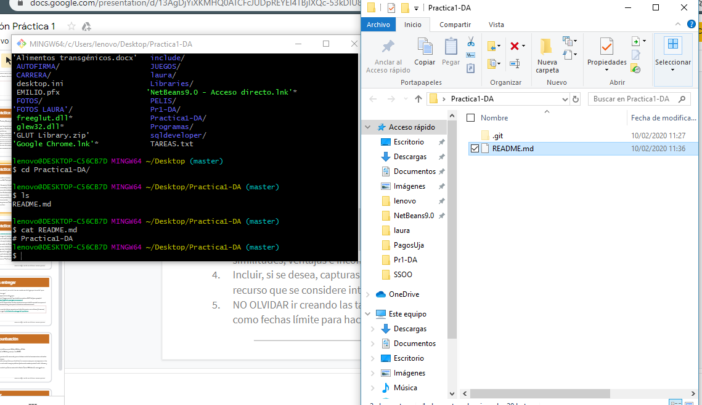
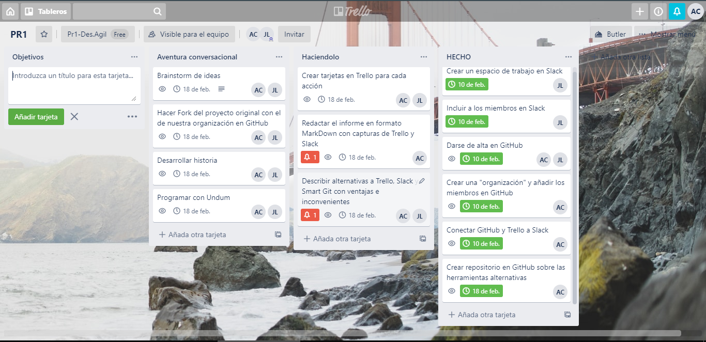
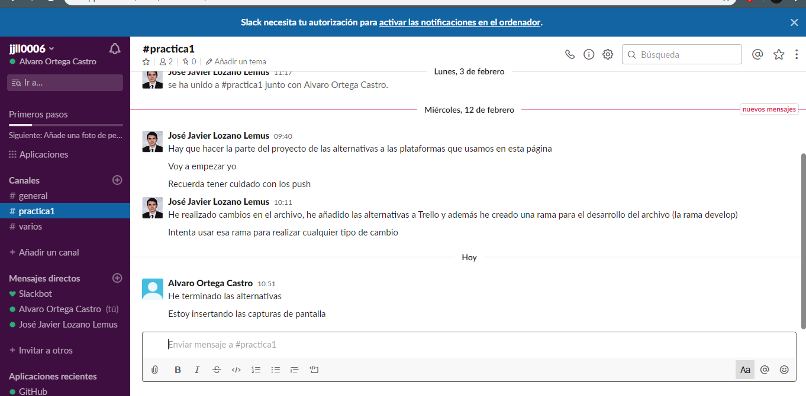
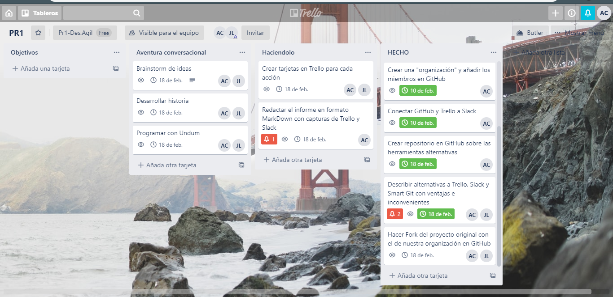

# Practica1-DA

Álvaro Ortega Castro aoc00023  
José Javier Lozano Lemus jjll0006

## Alternativas a Trello

Trello es una plataforma que trabaja con un sistema de información de Kanban. Por ello otras plataformas que usen un sistema de información Kanban puede ser considerado como una alternativa a Trello. A continuación mostraremos un par de ellas:

- **KanbanFlow**

Como indica su nombre, es una herramienta similar a Trello que usa sistemas de información Kanban. Al igual que Trello, se organiza de manera vertical con tareas y subtareas, distintos colores y con distintas personas o equipos asignados a los mismos. Además incluye la posibilidad de añadir un límite de tareas a una columna para evitar el uso de multitareas, y hay filtros como por ejemplo para realizar tareas recurrentes. KanbanFlow es gratis, aunque tiene funcionalidades extra si se usa un plan de pago. El problema es que no tiene ningún tipo de aplicación nativa, pero se puede usar desde cualquier tipo de navegador web.

- **Taiga**

Es otra herramienta de gestión de proyectos para desarrolladores y diseñadores, cuya principal característica es que es open source. Es similar a la hora de mostrar la información, pero además usa Scrum, la metodología de desarrollo ágil más prominente hoy en día, ya que ayuda a los programadores a gestionar el desarrollo de proyectos de manera eficiente. También posee una wiki con toda la documentación necesaria para el uso de la aplicación.

## Alternativas a Git Hub

Git Hub es la plataforma de alojamiento de códigos más popular de todas, donde podemos depositar códigos públicos, y donde podemos crear organizaciones para desarrollar proyectos en grupo. Algunas alternativas que hemos encontrado:

- **GitLab**

Es una web similar que destaca por permitir a los usuarios en sus servidores particulares, lo que le permite asociar un servidor web propio y gozar de mayor seguridad y privacidad de contenidos. Así se puede tener repositorios públicos y privados ilimitados y gratuitamente. Su principal problema es que hay que realizar muchas configuraciones previas que no son sencillas, por lo que es una plataforma para usuarios más experimentados que los de Git Hub.

- **Bitbucket**

Bitbucket se trata de una plataforma muy popular en la que individuos y organizaciones tienden a almacenar sus repositorios basados en código libre. Permite tener repositorios públicos, como así también privados ilimitados, lo cual atrae la atención de los desarrolladores que acostumbran a necesitar espacio de almacenamiento para almacenar sus archivos en la nube. Una de las funciones más destacadas de Bitbucket es el hecho de permitir a los usuarios intercambiar o enviar achivos a otros usuarios a través de la misma plataforma.

## Alternativas a Slack

Slack es una plataforma para gestionar trabajos y proyectos de forma colaborativa. Se pueden crear diferentes canales para tratar diferentes temas o canalizar las diferentes vías de comunicación de una empresa.

- **Spike**

Spike ha reinventado la comunicación en el seno de los equipos. Aunque hoy sigue siendo el correo electrónico el que lleva el mayor peso de la comunicación en las empresas modernas, el programa topa con sus límites cuando se trata de seguir la correlación de mensajes en una discusión más larga. La aplicación Spike traslada esta dinámica a un formato más conocido por los programas de mensajería y chat: la representación visual en forma de diálogo, prescindiendo para ello de la línea de asunto y de la firma. De este modo, el usuario puede comunicarse por correo electrónico de una forma más natural que recuerda a la propia de un chat.

- **Mattermost**

Mattermost es otra solución de código abierto para la comunicación interna en las empresas que permite el alojamiento en servidores propios o una nube privada tras un cortafuegos. De este modo, siempre tendrás un control total sobre los datos confidenciales. Esta alternativa a Slack se puede integrar fácilmente en la infraestructura existente de tus servidores. Si alojas tus proyectos en una nube pública, simplemente tienes que añadir Mattermost al entorno de alojamiento. Los usuarios elogian especialmente la sencilla escalabilidad de esta aplicación.

## Capturas

